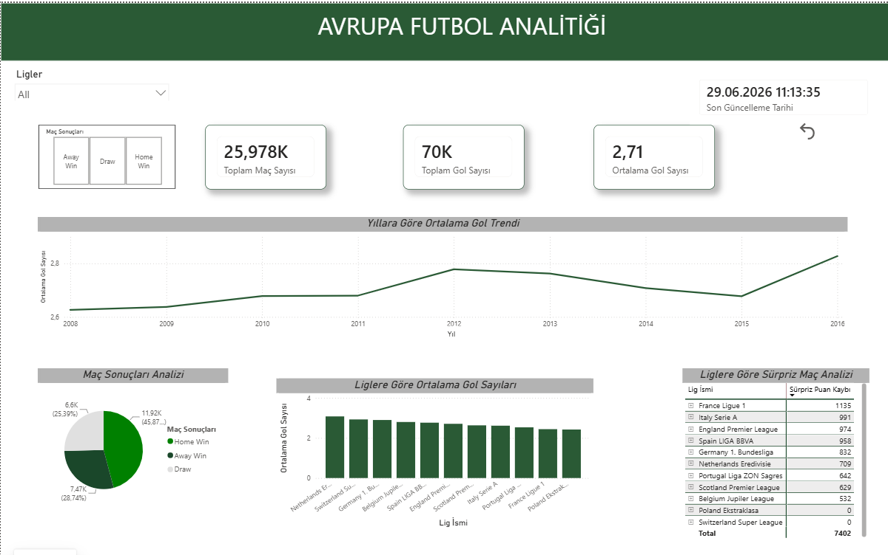
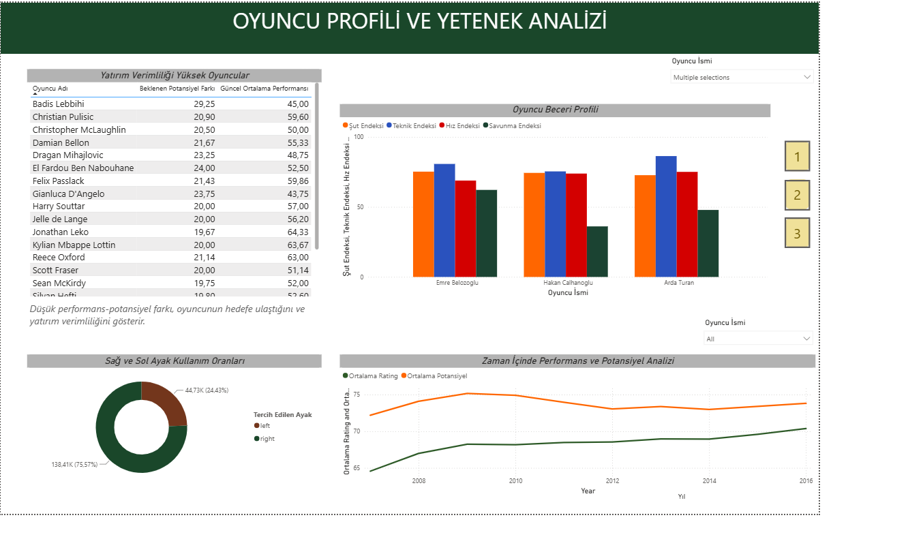
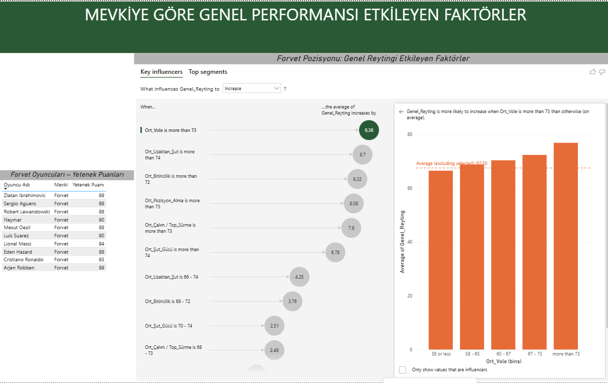

# European Soccer Analysis

An end-to-end data analytics project exploring European soccer data using **SQL, Google BigQuery, and Power BI**. The project focuses on team performance, league comparisons, player attributes, match outcomes, and player performance trends through SQL analysis and interactive dashboards.

## Project Overview

The project was developed as a **team project** using the European Soccer dataset.

The workflow included:

- Exploring and preparing soccer data in Google BigQuery
- Writing SQL queries for data cleaning, transformation, and analysis
- Analyzing team and league performance
- Exploring player attributes and performance trends
- Preparing player-position data for further machine learning analysis
- Building interactive Power BI dashboards to communicate insights

## Technologies Used

- SQL
- Google BigQuery
- Power BI
- Data Cleaning
- Data Transformation
- Data Visualization
- Exploratory Data Analysis
- Window Functions
- CTEs
- Data Preparation for Machine Learning

## SQL Analysis

The SQL analysis covers several areas of European soccer.

### Team & League Performance

Analysis includes:

- Home and away performance
- Win rates and points per game
- Goal scoring and defensive performance
- Home-field advantage
- League goal profiles
- Competitive balance between leagues
- Seasonal performance trends
- Championship race analysis

Advanced SQL techniques such as **CTEs, CASE statements, UNION ALL, aggregations, RANK, DENSE_RANK, LAG, ROW_NUMBER, and window functions** were used throughout the analysis.

### Player Analysis

Player-level analysis includes:

- Overall player ratings
- Player potential
- Age and performance relationships
- Physical attributes and performance
- Player position analysis

## Machine Learning Data Preparation

A SQL-based data preparation workflow was developed to create an ML-ready dataset for player-position analysis.

The process included:

- Checking missing values and data types
- Selecting the latest player attribute records
- Transforming match formation data into player-level observations
- Creating player position labels from historical match information
- Identifying each player's most frequently played position
- Joining player attributes with position labels

This produced a structured dataset that can be used for future player-position classification analysis.

## Power BI Dashboard

### Dashboard Overview

### Player Profile & Talent Analysis

### Key Influencers – Forward Position

The Power BI report contains interactive dashboards covering:

- Match and goal analysis
- League performance
- Betting and match outcome analysis
- Player performance
- Position-specific player attributes
- Age-performance trends
- Key Influencers analysis

The Power BI project file is included in this repository.

## Repository Files

- `European Soccer Analysis_02.07.2026.pbix` – Power BI dashboard
- `european_soccer_analysis.sql` – Core SQL analyses
- `dashboard_analysis.sql` – Dashboard-focused SQL queries
- `stg_player_attributes.sql` – Player attribute staging and deduplication
- `player_position_ml_preparation.sql` – Player-position ML dataset preparation

## Project Type

This project was completed collaboratively as a **team project** during the Data Analytics & Data Science program at Workintech.

My contributions included working with **SQL and BigQuery for data analysis and transformation** and contributing to the **Power BI reporting and analytical workflow**.
